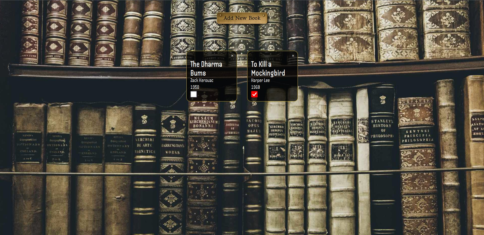
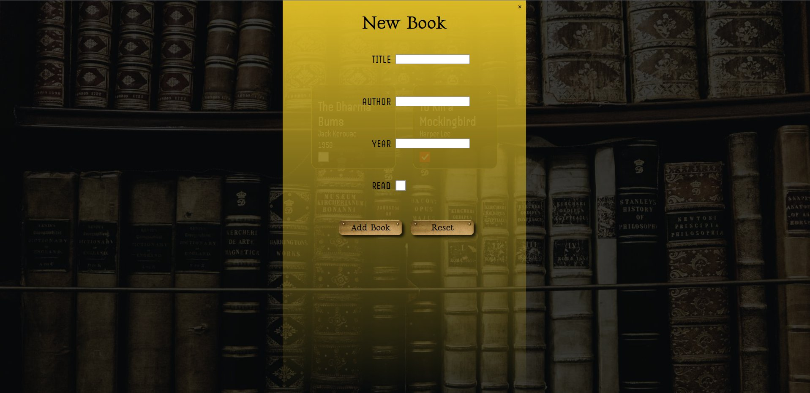

# book-wizard

A browser app to keep track of books you read.

[Live preview](https://bwd202.github.io/book-wizard/) ⬅️

## Features

### HTML

- form

### CSS

- grids
- background images
- fonts
- color gradients
- shadows
- variables

### JS

- event handlers
- form validation
- modules

### Libraries

- @fontsource

### Other Tools

- webpack
- npm